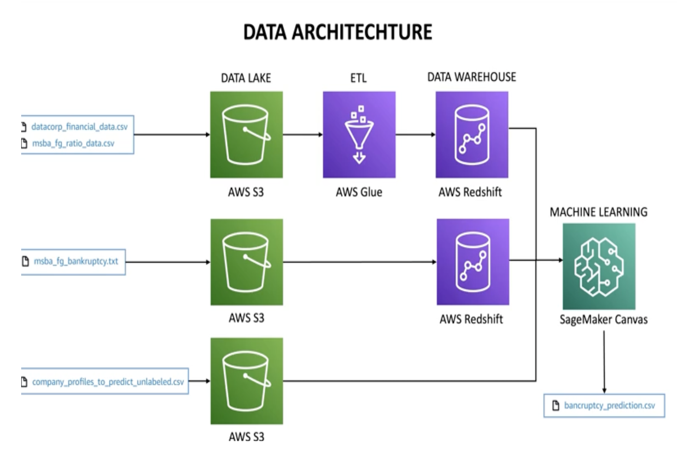
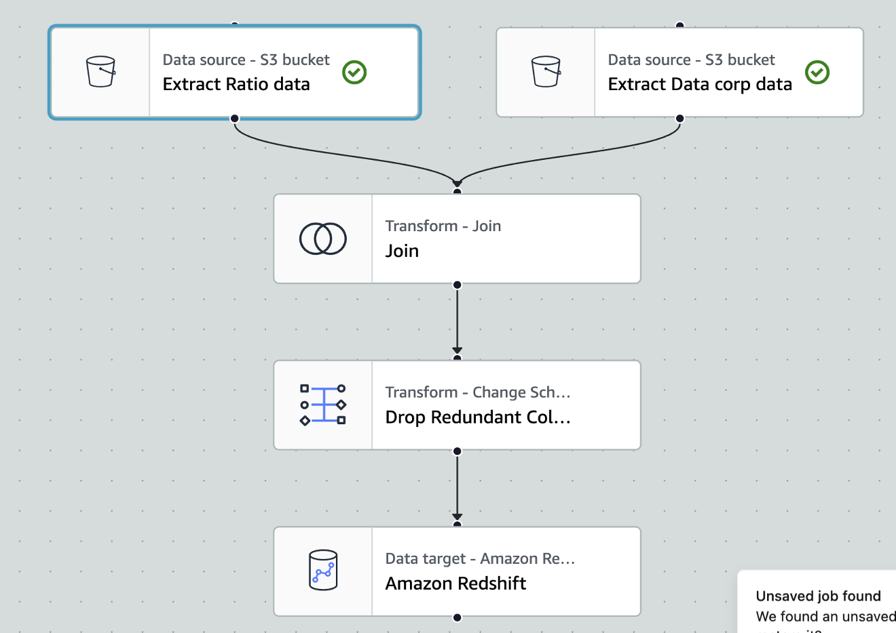
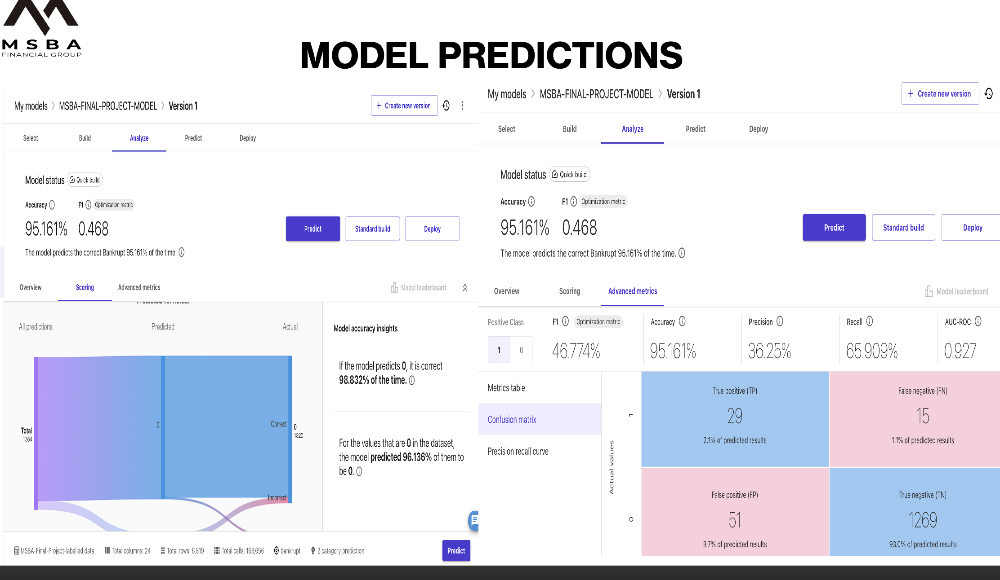

# Cloud Technology: End-to-End AWS Data Architecture

This project showcases an end-to-end data pipeline built using **Amazon Web Services (AWS)** for a business case presented by **MSBA Financial Group**. It simulates how a cloud-native architecture can enable scalable, efficient data processing — from raw ingestion to machine learning-based predictions.

## 🧠 Business Context

MSBA Financial Group, a specialized investment firm, required a data architecture to predict potential bankruptcy risks in companies based on historical financial data. My role was to develop and explain a **cloud-native architecture** that enabled seamless data flow and insight generation.

---

## 🛠️ Tools Used

- **Amazon S3** – for data lake (storage)  
- **AWS Glue** – for ETL pipeline (transformations & Redshift load)  
- **Amazon Redshift** – as data warehouse  
- **Amazon SageMaker Canvas** – for low-code machine learning predictions  

---

## 🔧 My Role

I independently designed and implemented the full AWS pipeline, from ingesting data into S3 buckets to building a no-code ML model in SageMaker Canvas. I prepared the infrastructure and ran transformations using Glue Studio, then explained the model results in a professional presentation.

---

## 📊 Data Architecture

## ⚙️ AWS Glue Job Flow

## 🤖 Model Output from SageMaker Canvas

- **Accuracy:** 95.16%  
- **Precision:** 36.25%  
- **Recall:** 65.91%  
- **AUC-ROC:** 0.927  

The model correctly predicted bankruptcy ~95% of the time using historical data.

---

## 📁 Files Included

| File | Description |
|------|-------------|
| `Presentation.pdf` | Executive summary with slides on architecture, data, and results |
| `*.csv` files | Sample datasets used in S3 |
| `*.png` | Architecture, Glue, and ML screenshots |

---

## ✅ Key Learning Outcomes

- Gained hands-on experience in **cloud-native analytics pipelines**  
- Strengthened skills in **ETL orchestration**, **data warehousing**, and **low-code machine learning**  
- Practiced business storytelling using technical tools  

---

## 🔗 Let's Connect

Feel free to reach out if you want to talk cloud pipelines or data architectures:

- 💼 [LinkedIn](https://www.linkedin.com/in/armashaik)  
- 📬 arma.rahamath@gmail.com

---

## 📂 More Projects

Check out my full analytics portfolio: [GitHub Projects](https://github.com/ArmaShaik)
